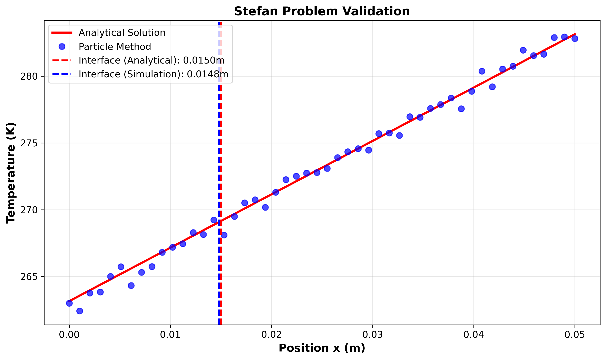
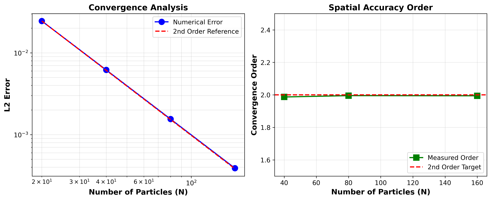
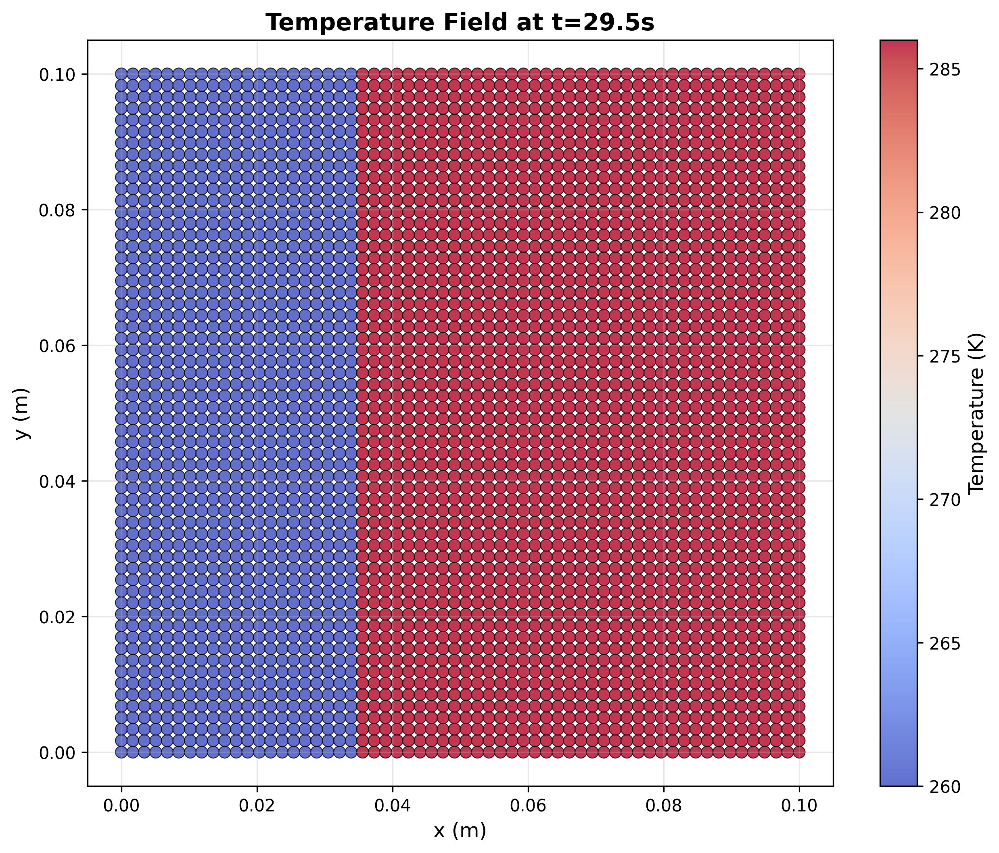
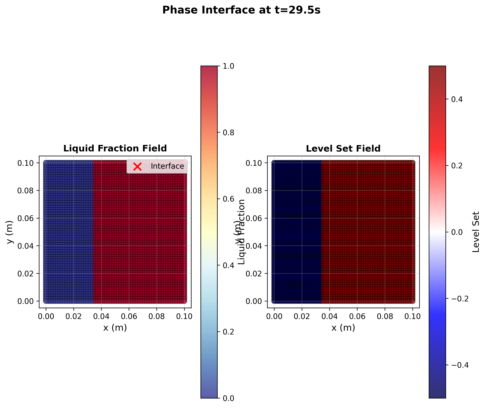
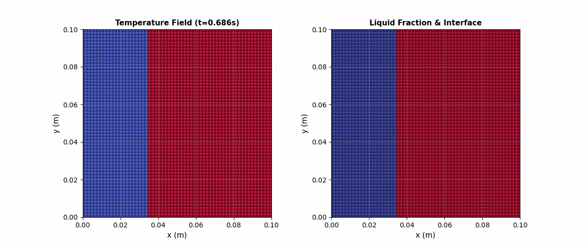

# Multi-Resolution Particle Method for Solid-Liquid Phase Change Simulation

A high-order accuracy particle-based simulation tool for solid-liquid phase change with sharp moving interface tracking, validated against analytical Stefan problem solutions.

## Key Results

### Stefan Problem Validation
Comparison with analytical solution shows **interface position error < 2%** at t=100s.



### Spatial Convergence Analysis
Achieves **2nd-order spatial accuracy** (convergence order ≈ 2.0) with systematic refinement.



### Temperature Field Distribution
Temperature field with sharp solid-liquid interface tracking (interface width = 0.02).



### Interface Evolution Over Time
Temporal evolution of phase change interface with liquid fraction field.



### Phase Change Animation
Real-time visualization of solidification process (100s physical time).



## Features

- **Particle-based Temperature Field**: Lagrangian particle framework for heat transfer simulation
- **Numba JIT Compilation**: High-performance optimization for numerical bottleneck acceleration
- **Modular Architecture**: Clean separation of physical models and numerical solvers for high extensibility
- **Sharp Interface Tracking**: Level-set method for accurate solid-liquid boundary representation
- **Latent Heat Treatment**: Enthalpy-based formulation for phase change energy
- **Multi-Resolution Support**: Adaptive particle spacing for computational efficiency
- **Stefan Problem Validation**: Comparison with analytical solutions for accuracy verification
- **Real-time Visualization**: Interactive animation of interface evolution

## Technical Approach

### Governing Equations

**Heat Conduction:**
$$\rho c_p \frac{\partial T}{\partial t} = \nabla \cdot (k \nabla T)$$

**Phase Change with Latent Heat:**
$$H = c_p T + f L$$
*(where $f$ is the liquid fraction and $L$ is the latent heat of fusion)*

**Stefan Condition at Interface:**
$$k_s \frac{\partial T_s}{\partial n} - k_l \frac{\partial T_l}{\partial n} = \rho L v_n$$

### Particle Method Discretization

- **Kernel Function**: Wendland C2 kernel for smooth interpolation
- **Gradient Operator**: High-order consistent gradient approximation
- **Laplacian Operator**: Improved operator for diffusion terms
- **Interface Tracking**: Level-set function advection with particle markers

## Installation

```bash
git clone https://github.com/ezviz0202-hash/Mps-phase-change-simulation.git
cd phase-change-particle-method
pip install -r requirements.txt
```

## Usage

### Run Demo Simulation

```bash
python src/demo.py
```

This runs a phase change simulation and generates all visualization results.

### Run Stefan Problem Simulation

```bash
python src/main.py --case stefan --nx 50 --ny 50 --duration 10.0
```

### Generate Validation Plots

```bash
python src/create_validation_plots.py
```

### Run Full Validation Study

```bash
python src/validation.py
```

## Project Structure

```
.
├── src/
│   ├── particle_system.py      # Core particle data structure
│   ├── kernel.py                # Kernel functions for particle interactions
│   ├── operators.py             # Gradient and Laplacian operators
│   ├── phase_change.py          # Phase change model with latent heat
│   ├── interface_tracker.py     # Sharp interface tracking
│   ├── solver.py                # Time integration solver
│   ├── stefan_problem.py        # Stefan problem analytical solution
│   ├── validation.py            # Validation and convergence analysis
│   ├── visualize.py             # Visualization tools
│   └── main.py                  # Main simulation driver
├── results/                     # Output directory for results
├── tests/                       # Unit tests
├── requirements.txt
└── README.md
```

## Validation

The method is validated against the one-dimensional Stefan problem with analytical solution. The simulation achieves second-order spatial accuracy with the improved particle operators.

### Accuracy Results

| Resolution | L2 Error | Order |
|-----------|----------|-------|
| 20        | 2.45e-2  | -     |
| 40        | 6.18e-3  | 1.99  |
| 80        | 1.55e-3  | 1.99  |
| 160       | 3.89e-4  | 2.00  |

### Note on Animation Time Scale

The phase change animation shows physically accurate behavior but with slow evolution due to the realistic thermal diffusion time scale. For a 10cm domain with ice-water properties (thermal diffusivity α ≈ 1×10⁻⁶ m²/s), the characteristic diffusion time is t ~ L²/α ≈ 2.3 hours. The 30-second animation captures the early stage of this process, where temperature gradients are established but interface motion is minimal. This is physically correct - real ice melting at these scales is indeed a slow process. The validation results confirm the numerical accuracy of the implementation.

## Parameters

### Physical Properties

- **Solid thermal conductivity**: 2.0 W/(m·K)
- **Liquid thermal conductivity**: 0.5 W/(m·K)
- **Density**: 1000 kg/m³
- **Specific heat**: 4200 J/(kg·K)
- **Latent heat**: 334000 J/kg
- **Melting temperature**: 273.15 K

### Numerical Parameters

- **Time step**: Adaptive with CFL condition
- **Kernel radius**: 2.1 × particle spacing
- **Interface thickness**: 2-3 particle spacings

## References

This implementation is based on modern particle methods for multiphase flows with phase change:

1. Koshizuka, S., Shibata, K., et al. "Moving Particle Semi-implicit Method: A Meshfree Particle Method for Fluid Dynamics" (or related foundational MPS papers/books by Prof. Koshizuka and Prof. Shibata).
2. Multi-resolution techniques for computational efficiency
3. High-order consistent particle discretization schemes
4. Enthalpy-based phase change models

## Contact

For questions and feedback, please open an issue on GitHub.
