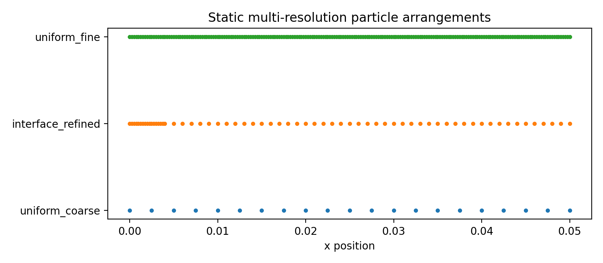
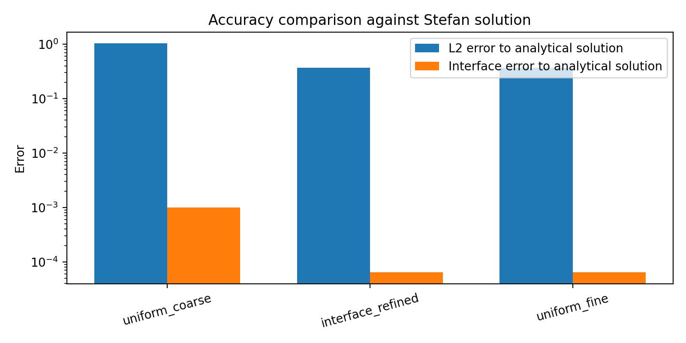
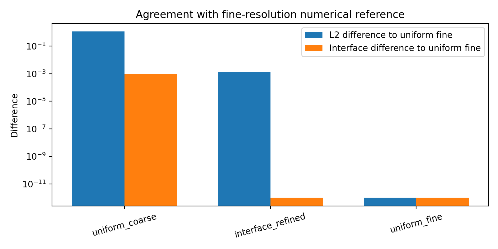
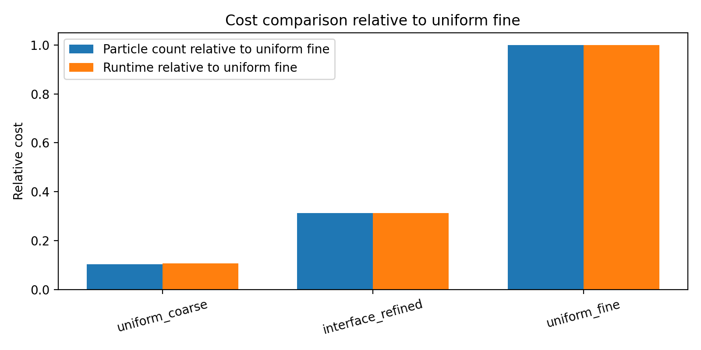
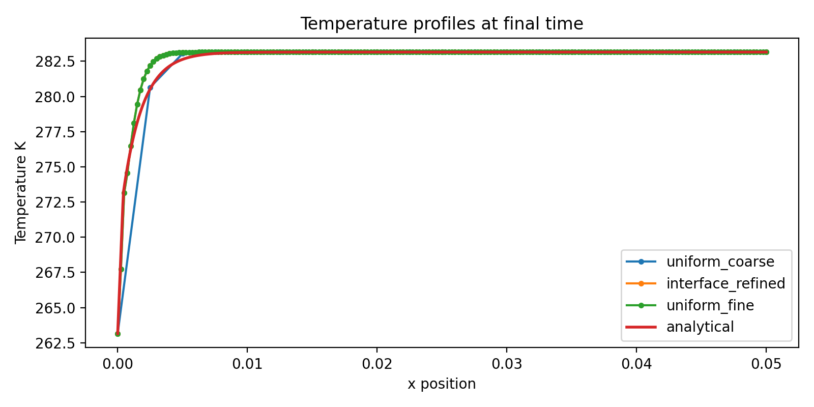

# Update: Interface-focused Static Multi-resolution Refinement Benchmark

This update adds a preliminary static multi-resolution particle arrangement benchmark for evaluating accuracy-cost tradeoffs in the Stefan problem.

---

## Motivation and Related Work

This update is motivated by research on variable-resolution particle methods and computational cost reduction, especially studies related to multi-resolution particle methods such as the overlapping particle technique.

Prof. Kazuya Shibata and collaborators have worked on multi-resolution particle method techniques for reducing computational cost in particle-based simulations. In particular, the overlapping particle technique represents a simulation domain using partially overlapping subdomains with different spatial resolutions. This idea is closely related to the general motivation of this update: concentrating computational resolution only where it is most needed.

However, the present implementation is not a reproduction of the overlapping particle technique. It does not implement overlapping subdomains, bidirectional coupling between overlapping particle regions, dynamic particle splitting, or dynamic particle merging.

Instead, this update provides a simplified static multi-resolution benchmark for the Stefan problem. The goal is to evaluate whether an interface-focused particle arrangement can approximate the fine-resolution numerical result with fewer particles while improving accuracy compared with a uniformly coarse particle distribution.

Related research directions include:

- Variable-resolution particle methods for reducing computational cost
- Overlapping particle techniques for multi-resolution particle simulation
- Particle-based simulation of free-surface and multiphysics phenomena
- Accuracy-cost tradeoff evaluation in particle methods

This benchmark should therefore be understood as a preliminary extension inspired by these research directions, rather than a direct implementation of a specific published algorithm.

---

## Results and Figures

### 1. Static multi-resolution particle arrangements



This figure shows the three particle arrangements used in the benchmark.

- `uniform_coarse`: a uniformly coarse particle distribution.
- `interface_refined`: a static multi-resolution distribution with finer particles near the phase-change interface region and coarser particles away from the interface.
- `uniform_fine`: a uniformly fine particle distribution used as the fine-resolution numerical reference.

The interface-refined case concentrates particles near the region where the temperature gradient and interface motion are most important, while reducing the number of particles in smoother regions.

---

### 2. Accuracy comparison against Stefan analytical solution



This figure compares the numerical results against the analytical Stefan solution.

The interface-refined case significantly reduces both the temperature-field L2 error and the interface-position error compared with the uniform coarse case. Its accuracy is close to the uniform fine case while using substantially fewer particles.

---

### 3. Agreement with fine-resolution numerical reference



This figure evaluates the difference between each case and the uniform fine numerical result.

The interface-refined case shows a very small L2 difference from the uniform fine solution, indicating that the static interface-focused refinement can reproduce the fine-resolution numerical behavior with fewer particles.

---

### 4. Cost comparison relative to uniform fine case



This figure compares the relative particle count and runtime using the uniform fine case as the baseline.

The interface-refined case uses about 31% of the particles of the uniform fine case and also requires about 31% of the runtime in this benchmark. This suggests that static interface-focused refinement can improve the accuracy-cost balance.

---

### 5. Temperature profiles at final time



This figure compares the temperature profiles at the final simulation time.

The interface-refined and uniform fine cases produce similar temperature distributions and are closer to the analytical Stefan solution than the uniform coarse case.

---

## Summary of Numerical Results

| Case | Particles | Steps | L2 Error to Analytical | Interface Error to Analytical | L2 Difference to Uniform Fine | Runtime |
|---|---:|---:|---:|---:|---:|---:|
| uniform_coarse | 63 | 175 | 1.030771 | 9.927131e-04 | 1.142391 | 0.0085415 s |
| interface_refined | 189 | 175 | 0.367159 | 6.393446e-05 | 1.279620e-03 | 0.0249531 s |
| uniform_fine | 603 | 175 | 0.367109 | 6.393446e-05 | 0.000000 | 0.0798619 s |

The interface-refined case uses 189 particles, which is about 31.3% of the uniform fine case. Despite this reduction, it achieves almost the same L2 error and interface-position error as the uniform fine case.

Compared with the uniform coarse case, the interface-refined case substantially reduces both the temperature-field error and the interface-position error.

---

## Method

This benchmark compares three static particle arrangements for the one-dimensional Stefan problem:

1. Uniform coarse particle distribution
2. Interface-focused static multi-resolution particle distribution
3. Uniform fine particle distribution

All three cases use the same final time and the same number of time steps. This makes the comparison fair with respect to temporal discretization.

The benchmark evaluates:

- temperature-field L2 error against the analytical Stefan solution
- interface-position error against the analytical Stefan solution
- L2 difference from the uniform fine numerical reference
- particle count
- runtime

The interface-refined arrangement is static. It does not perform dynamic particle splitting, merging, or adaptive remeshing during the simulation.

---

## How to Run

From the project root directory, run:

```bash
python experiments/static_refinement_study.py
```

The output files will be generated in:

```bash
results/static_refinement/
```

Generated files include:

```bash
refinement_layout.png
refinement_error_comparison.png
refinement_reference_error_comparison.png
refinement_cost_comparison.png
refinement_temperature_profiles.png
refinement_summary.csv
```

---

## Relation to the Original Project

The original project focused on particle-based solid-liquid phase change simulation, Stefan problem validation, sharp interface tracking, and convergence analysis.

This update extends the project toward static multi-resolution particle arrangements and computational cost reduction.

Instead of replacing the original solver, this benchmark adds a focused numerical experiment for evaluating the accuracy-cost tradeoff of interface-focused particle refinement.


---

## Notes and Limitations

This extension should be understood as a static multi-resolution particle arrangement benchmark.

It is not a dynamic adaptive multi-resolution MPS solver. In particular, it does not include:

- dynamic particle splitting
- dynamic particle merging
- moving refinement zones
- adaptive remeshing
- full two-dimensional or three-dimensional multi-resolution MPS coupling

The goal of this update is to provide a controlled preliminary benchmark showing that interface-focused static refinement can approximate the fine-resolution numerical solution with fewer particles while improving accuracy compared with a uniformly coarse particle arrangement.
